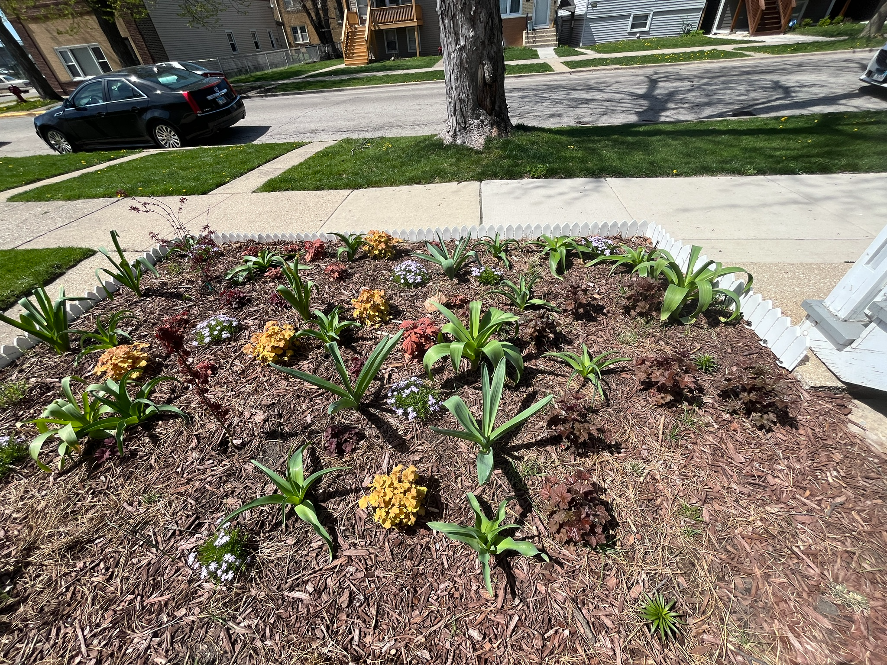
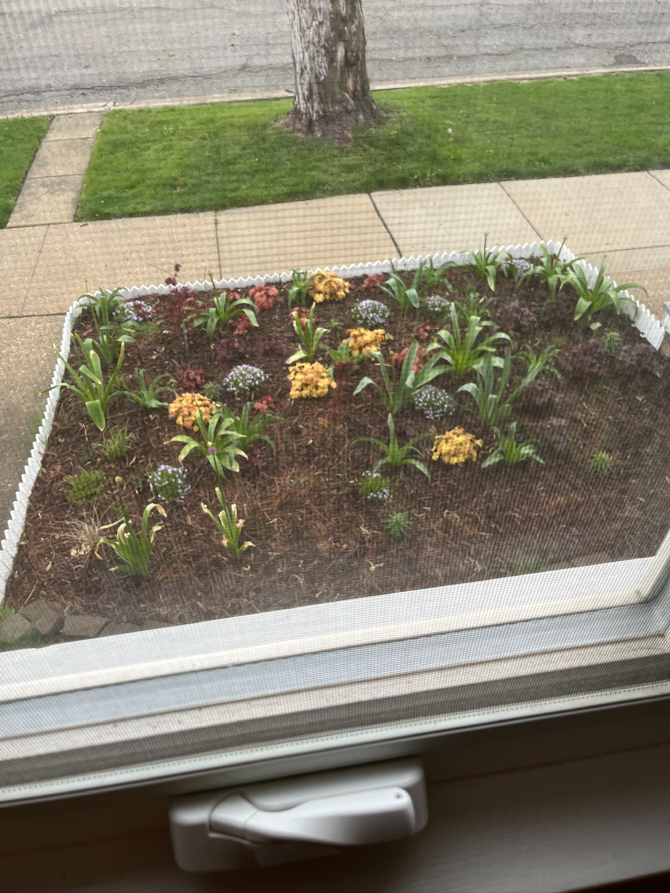
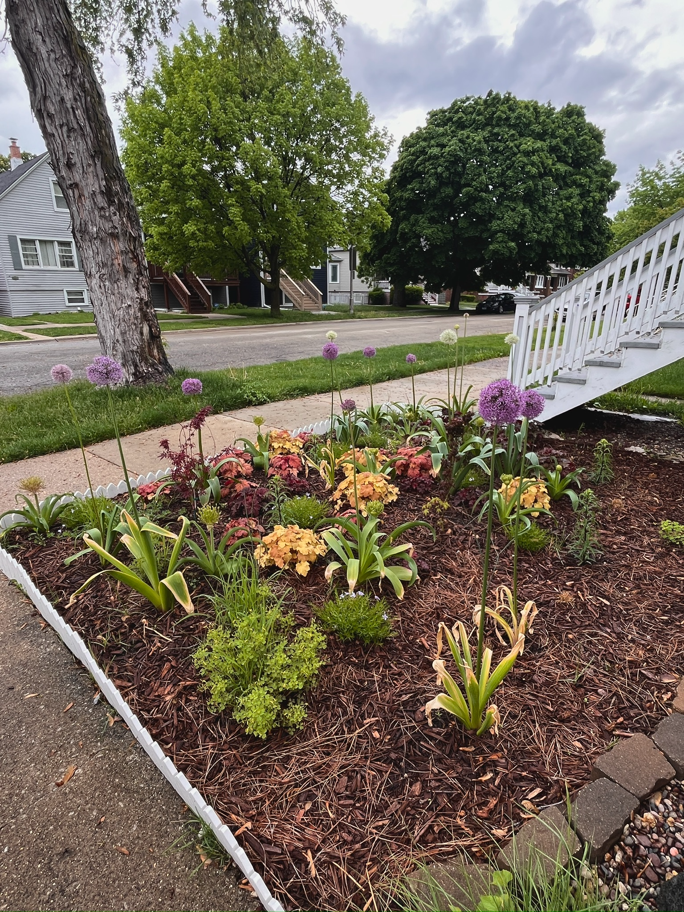
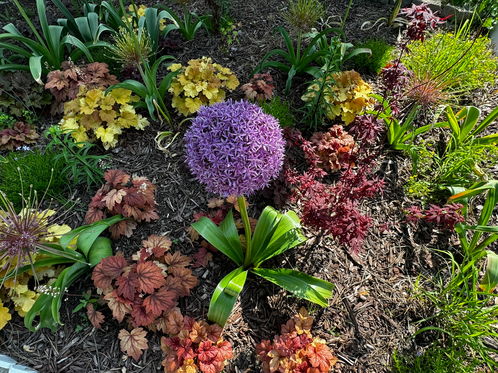
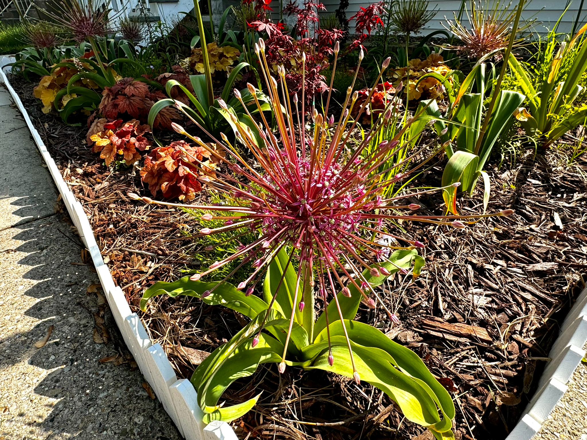
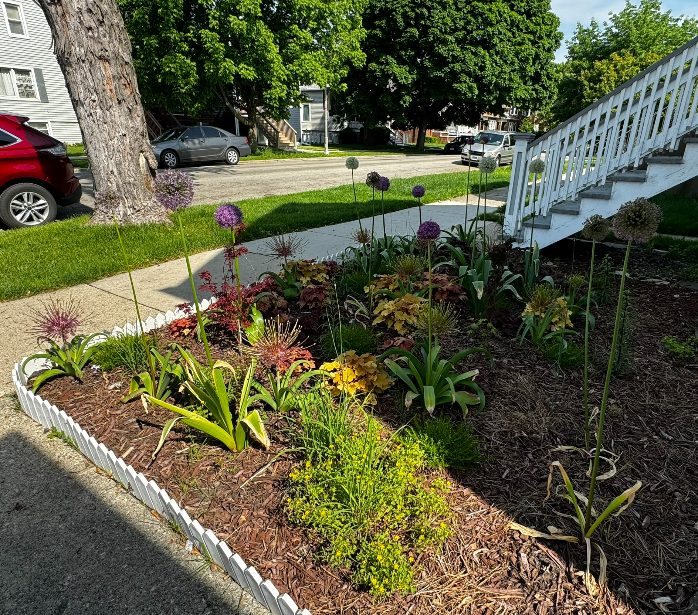
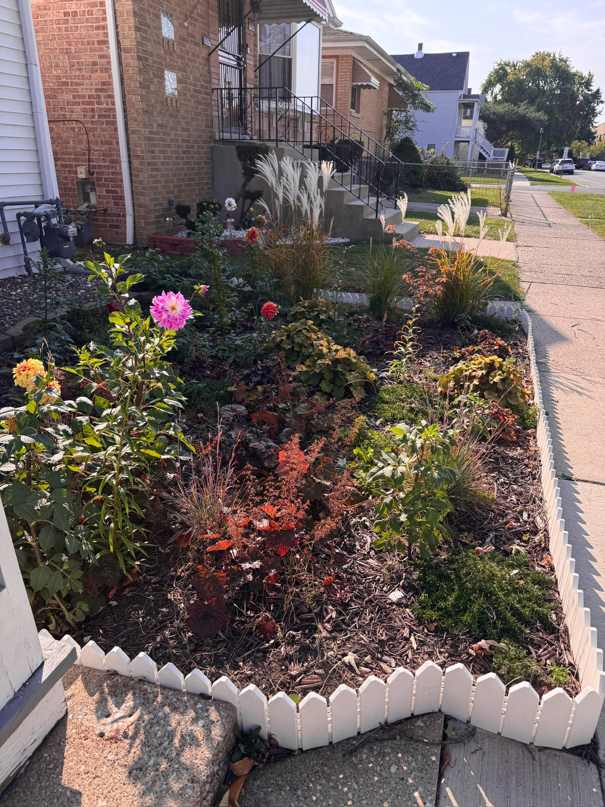

# 2024

- [2024](#2024)
  - [Front Yard](#front-yard)
    - [April](#april)
    - [May](#may)
    - [October](#october)

## Front Yard

### April

### May

### October

I ended up planting some dahlia tubers which produce some of the vibrant flowers. These are not perennial in my zone and need to be dug up in the fall in order to come back, but the long blooming time late in the season is worth it!

