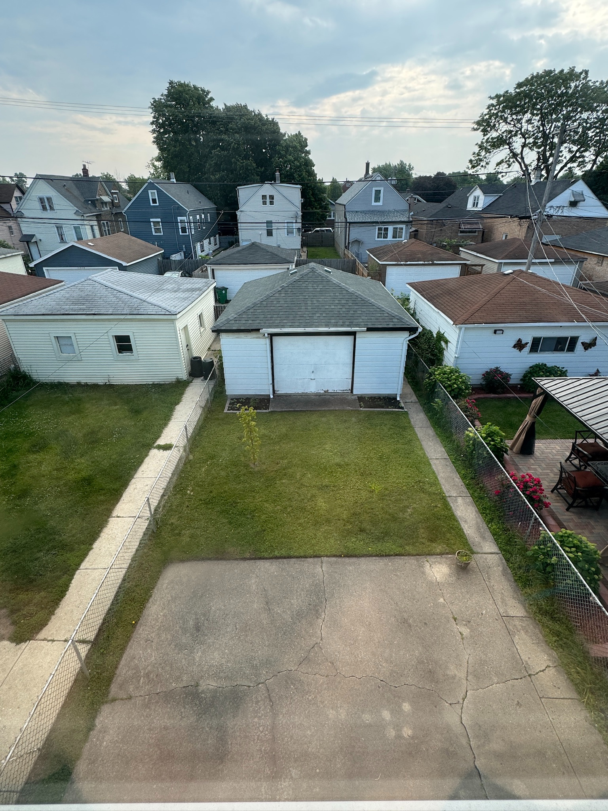
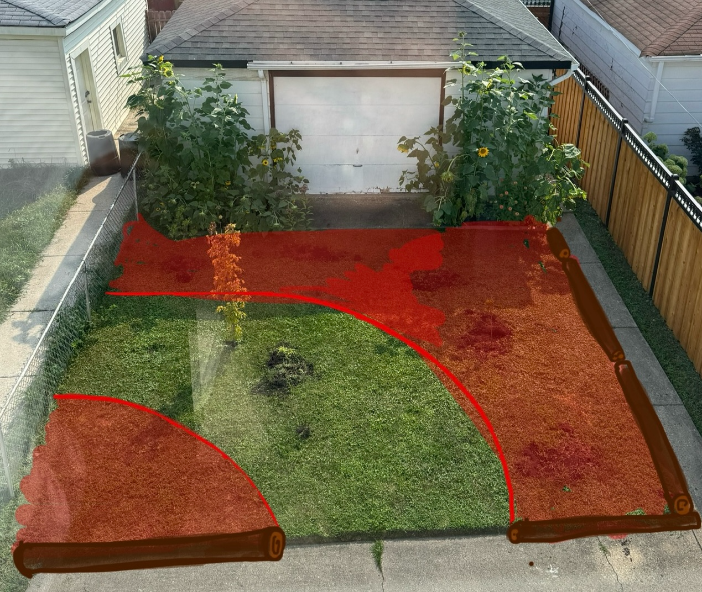
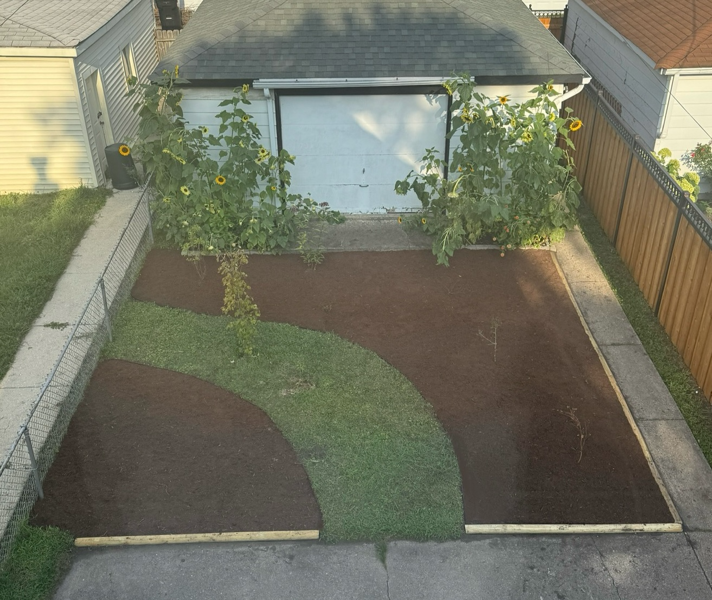
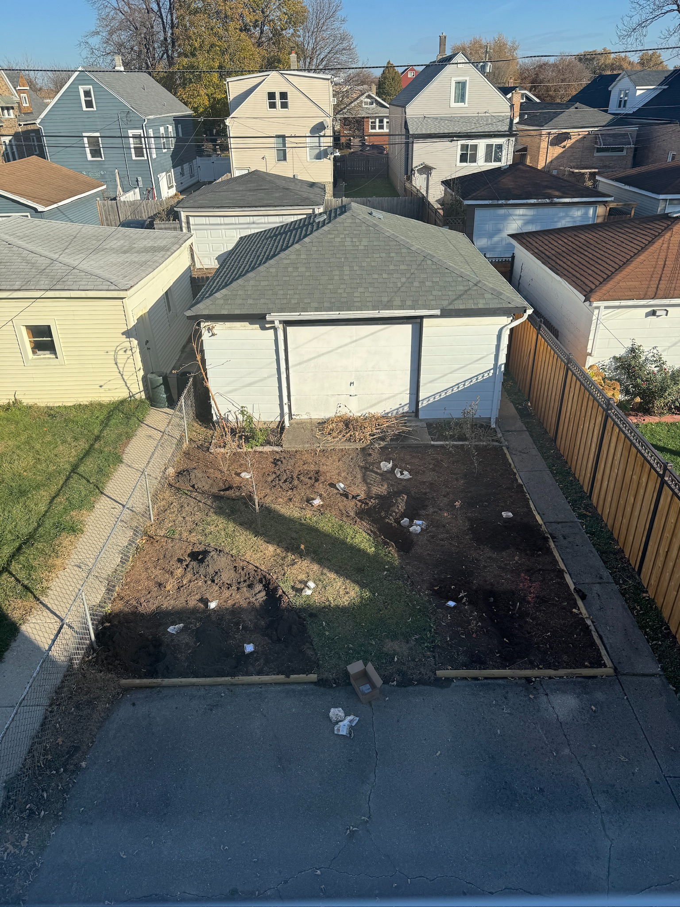
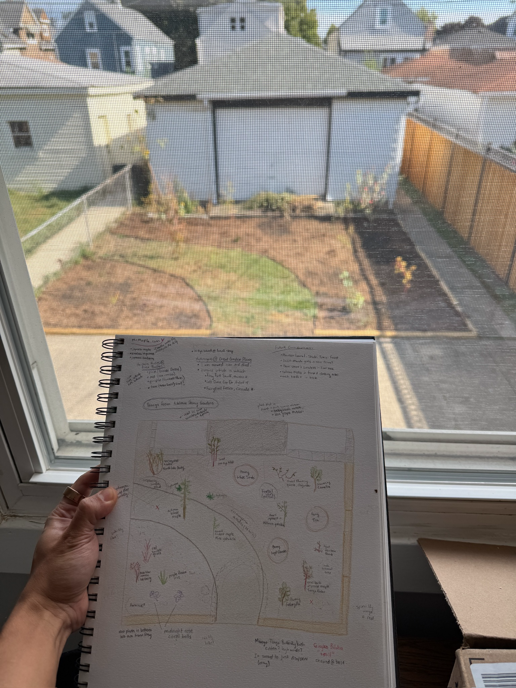

# 2025

- [2025](#2025)
  - [Backyard](#backyard)
    - [Before](#before)
    - [Design](#design)
    - [Thumbtack Result](#thumbtack-result)
    - [Planting](#planting)

## Backyard

### Before

### Design

I designed an experimental idea to use in the backyard.

### Thumbtack Result

I ended up hiring a contractor from Thumbtack to remove the sod and replace with grass. Unlike my front yard, I didn't want to mulch over the grass and add edging. They used my picture to help guide their work.

The work took their 3 person team a full 8 hour day to complete. They really worked hard! I'm glad I didn't try to tackle this project myself.

### Planting

In the fall, I planted a ton of plants, more dwarf Japanese maples and bulbs for the spring.

